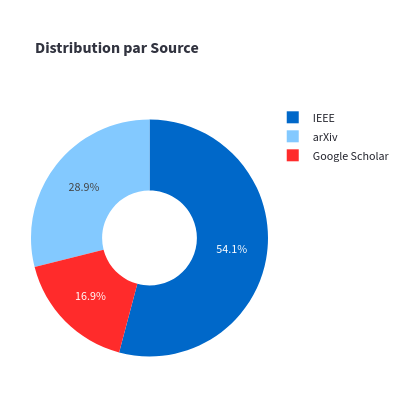
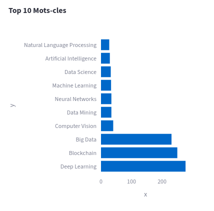
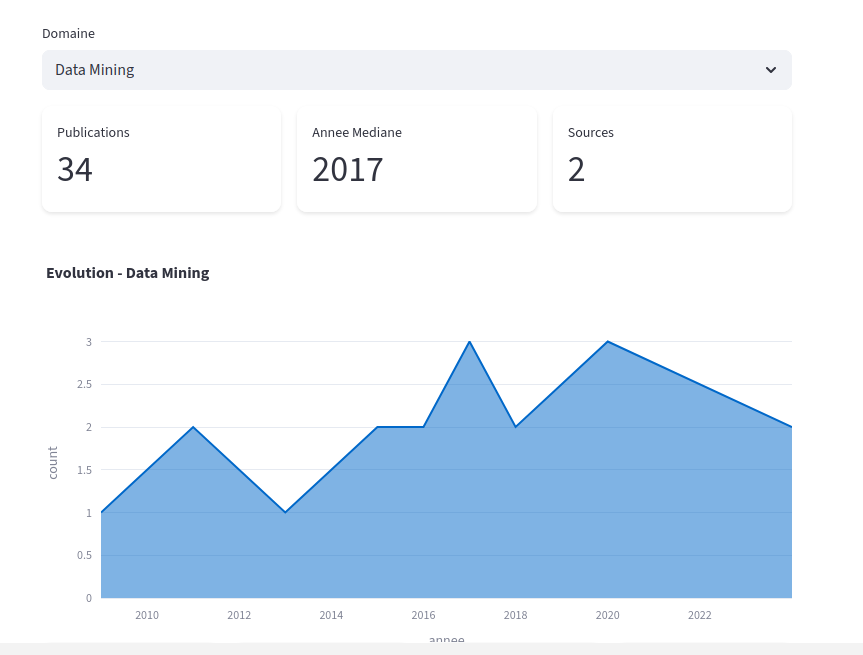
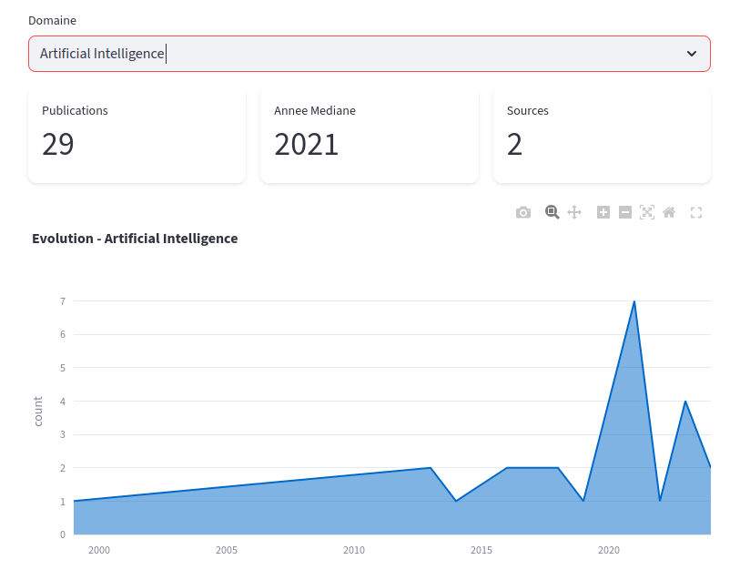
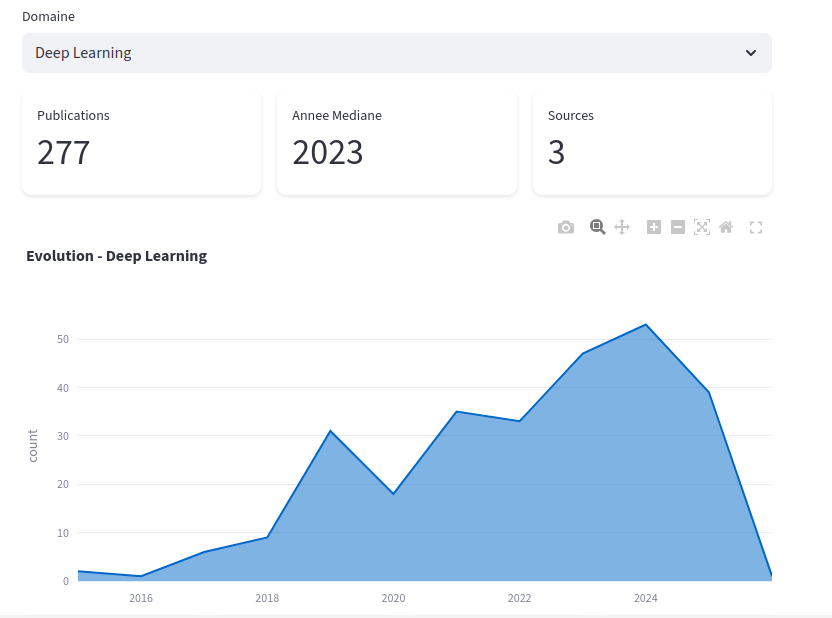

# Research Article Scraper

Scrapy-based web scraper for collecting academic articles from multiple sources.

## 📊 Data Sources

| Source | Status | Articles/Keyword | Notes |
|--------|--------|------------------|-------|
| **arXiv** | ✅ Working | 50 | API-based, no CAPTCHA |
| **IEEE** | ✅ Working | 250 (10 pages) | Selenium required |
| **Google Scholar** | ⚠️ Limited | 20 | May trigger CAPTCHA |
| **ACM** | ❌ Blocked | - | Cloudflare protection |
| **ScienceDirect** | ❌ Blocked | - | Cloudflare protection |

## 🚀 Quick Start

### Prerequisites
```bash
pip install scrapy pymongo selenium webdriver-manager
```

### MongoDB Setup
```bash
# Start MongoDB
mongod

# Verify connection
mongosh
use research_db
```

### Run Scrapers
```bash
# Best option - arXiv (no CAPTCHA)
python -m scrapy crawl arxiv

# IEEE (with pagination)
python -m scrapy crawl ieee

# Google Scholar (use sparingly)
python -m scrapy crawl scholar
```

## 📁 Project Structure
```
Data scraper/
├── spiders/
│   ├── arxiv_spider.py          # ✅ Recommended
│   ├── ieee_spider.py           # ✅ Works well
│   ├── scholar_spider.py        # ⚠️ CAPTCHA risk
│   ├── acm_spider.py            # ❌ Blocked
│   └── sciencedirect_spider.py  # ❌ Blocked
├── items.py                     # Data structure
├── pipelines.py                 # MongoDB pipeline
├── selenium_middleware.py       # Browser automation
├── settings.py                  # Scrapy config
└── scrapy.cfg
```

## 🔧 Configuration

### Keywords
Edit keywords in each spider file:
```python
keywords = ['Machine Learning', 'Deep Learning', 'AI']
```

### MongoDB
Edit in `settings.py`:
```python
MONGO_URI = 'mongodb://localhost:27017/'
MONGO_DATABASE = 'research_db'
```

## 📈 Expected Results

- **arXiv**: ~1,500 articles (30 keywords × 50)
- **IEEE**: ~2,250 articles (9 keywords × 250)
- **Scholar**: ~500 articles (25 keywords × 20)
- **Total**: ~4,250 articles

## 🛡️ Anti-Detection

- Random delays between requests
- Selenium with anti-detection scripts
- Cookie acceptance automation
- Human-like scrolling behavior

## 📊 View Data

```bash
# MongoDB Shell
mongosh
use research_db
db.articles.countDocuments()
db.articles.find().limit(5)

# Export to JSON
mongoexport --db=research_db --collection=articles --out=articles.json

# Export to CSV
mongoexport --db=research_db --collection=articles --type=csv --fields=titre,auteurs,annee,source --out=articles.csv

# Or use the Python script
python export_to_csv.py
```

## 🧹 Data Cleaning

After scraping, clean and analyze your data using our Kaggle notebook:

**[📓 Data Processing Notebook](https://www.kaggle.com/code/errrrr13ee/data-processing)**

The notebook includes:
- Data cleaning and preprocessing
- Duplicate removal
- Missing value handling
- Exploratory data analysis
- Visualizations

## ⚠️ Important Notes

1. **Use arXiv as primary source** - Most reliable, no CAPTCHA
2. **IEEE requires Selenium** - Browser will open automatically
3. **Respect rate limits** - Don't scrape too aggressively
4. **ACM/ScienceDirect blocked** - Use their official APIs instead
5. **Duplicates handled** - MongoDB unique index on `lien` field

## 🐛 Troubleshooting

### CAPTCHA Issues
- Increase `DOWNLOAD_DELAY` in settings.py
- Use `SELENIUM_HEADLESS = False` to solve manually
- Switch to arXiv (no CAPTCHA)

### MongoDB Connection Error
```bash
# Check if MongoDB is running
mongosh --eval "db.version()"
```

### Selenium ChromeDriver Issues
```bash
# Reinstall webdriver-manager
pip install --upgrade webdriver-manager
```

# BigData Research Pipeline - Dashboard BI et Analyses Avancées

Ce projet est une application de Business Intelligence développée avec Streamlit. Elle permet d'explorer, de filtrer et d'analyser des données issues de publications scientifiques stockées dans une base de données MongoDB.

## Fonctionnalités principales

### Dashboard BI
- Indicateurs clés (KPI) : Publications, Année Moyenne, nombre d'Auteurs et taux d'Abstracts.
- Répartition par Source : Visualisation des parts de marché des différentes plateformes.
- Top 10 Mots-clés : Les thématiques les plus populaires dans la recherche.
- Évolution Temporelle : Analyse du volume de publications par année.

### Analyses Avancées
- Analyse par Domaine : Exploration détaillée par mot-clé (Data Mining, AI, Deep Learning).
- Collaborations Scientifiques : Identification des auteurs et partenariats les plus actifs.

## Aperçu du Dashboard

### Statistiques Globales

*Répartition des articles par source.*


*Les 10 mots-clés les plus fréquents.*


*Progression historique des publications.*

### Analyses Spécifiques par Domaine

*Focus sur l'évolution du Data Mining.*


*Focus sur l'évolution de l'Intelligence Artificielle.*


*Focus sur l'évolution du Deep Learning.*

### Collaborations et Auteurs

*Classement des auteurs les plus prolifiques.*

## Technologies utilisées

- Python (Streamlit, Pandas, Plotly)
- MongoDB (Base de données NoSQL)
- PyMongo (Driver de connexion)

## Installation

1. Assurez-vous d'avoir MongoDB installé et configuré.
2. Installez les dépendances nécessaires :
   ```bash
   pip install -r requirements.txt


## Screen pour freamwork complet par streamlit 


    - remarque : video freamwork_streamlit (1).mp4 contient l'app complet 


## 📝 License

Educational use only. Respect robots.txt and terms of service.
